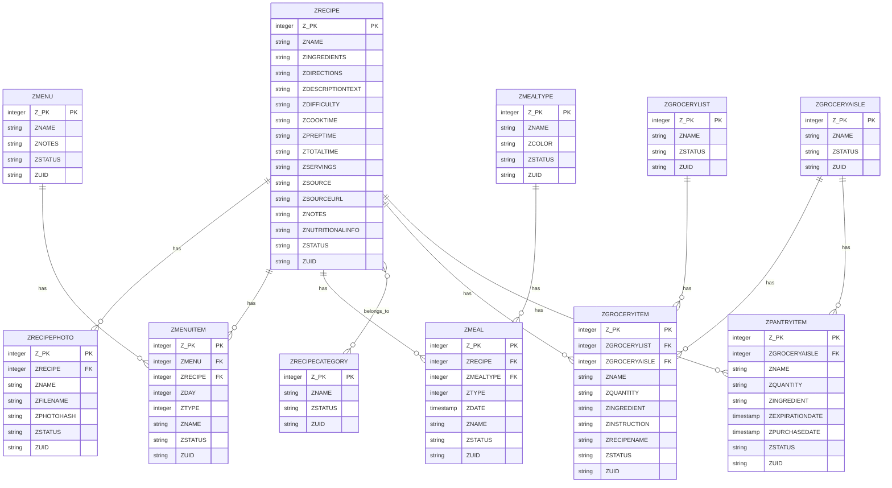

# Paprika AI Assistant

An AI-powered assistant for your Paprika Recipe Manager database. This application provides intelligent features like meal planning, recipe analysis, and ingredient substitutions using AI.

## Features

- 🤖 AI-powered meal planning
- 📊 Recipe analysis and insights
- 🔄 Ingredient substitution suggestions
- 🏷️ Category-based recipe filtering
- 📱 Modern, responsive UI

## Database Schema



## Setup

1. Clone the repository:
```bash
git clone https://github.com/yourusername/paprika_ai.git
cd paprika_ai
```

2. Install dependencies:
```bash
bundle install
```

3. Set up environment variables:
```bash
cp .env.example .env
```
Edit `.env` and add your API keys:
- `OPENAI_API_KEY` (optional, for ChatGPT features)
- `GEMINI_API_KEY` (required for Gemini features)

4. Configure database:
The app reads from your local Paprika Recipe Manager SQLite database. Update the path in `config/database.yml` if needed:
```yaml
readonly_paprika:
  adapter: sqlite3
  database: "/path/to/your/Paprika.sqlite"
  readonly: true
```

5. Start the server:
```bash
rails server
```

6. Visit `http://localhost:3000` in your browser

## Development

- Ruby version: 3.2.0
- Rails version: 8.0
- Database: PostgreSQL (development) + SQLite (Paprika read-only)

## License

MIT
