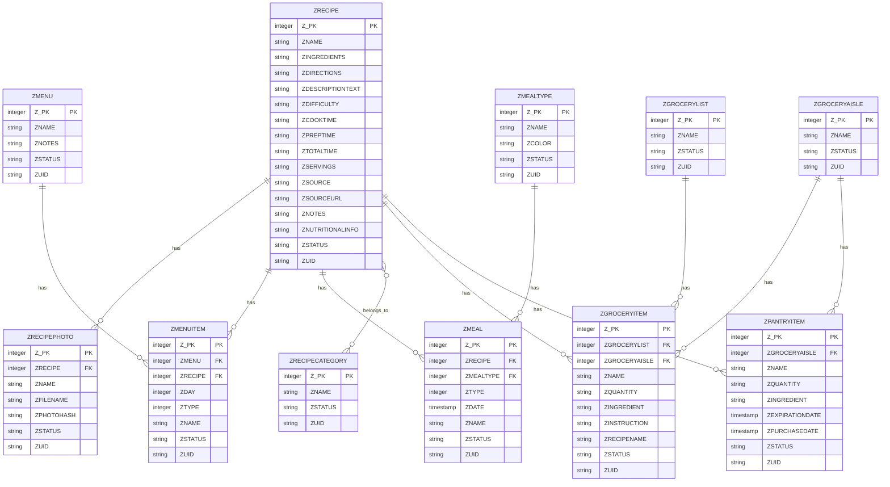

# Paprika AI Assistant

[](https://github.com/kleinjm/paprika_ai/actions/workflows/ci.yml)

An AI-powered assistant for your Paprika Recipe Manager database. This application provides intelligent features like meal planning, recipe analysis, and ingredient substitutions using AI.

## Features

### AI Meal Planning
- Multi-select recipe categories from your Paprika library to constrain the candidate pool
- Configurable number of recipes (default 4) and a customizable prompt, with a detailed default covering leftovers, stove/oven contention, and cuisine pairing
- Live prompt preview that updates as you tweak categories, count, or prompt text (Stimulus `meal-plan` controller backed by `home#meal_plan_prompt_preview`)
- Sends the candidate recipe pool as JSON to Gemini and returns a day-grouped meal plan with reasoning

### AI Recipe Analysis
- Lists every recipe from the read-only Paprika SQLite database along with its categories
- One-click "Analyze" button per recipe sends name, ingredients, and directions to Gemini
- Results render in place via Turbo Streams

### AI Ingredient Substitutions
- Free-text ingredient input returns Gemini-generated substitution suggestions, rendered via Turbo Stream

### AI Nutrition Tracking
A chat-style daily food log (`/nutrition`) that turns plain English into tracked macros.

- **Describe what you ate** in one message (e.g. `small bowl bean salad, medium plate chicken breast`). The LLM splits it into one entry per food and estimates calories, protein, carbs, fat, fiber, saturated fat, and sugar for the **portion eaten**.
- **Quick-pick pills + dropdown** below the reply build the message and, crucially, choose which recipes are in scope:
  - **Portion pills** (bowls/plates) append sizing text only.
  - **Meal pills** — recipes scheduled 7 days back through 2 days ahead — append the title *and* register the recipe id.
  - **"Add another recipe…" dropdown** lists every other non-trashed recipe for anything not scheduled.
  - Clicking appends to the input (with a leading space) and tracks the recipe id in hidden `recipe_ids[]` fields (Stimulus `meal-picker` controller).
- **Only the recipes you pick are sent to the LLM** — keyed by id, with their ingredients — instead of the whole library. The model returns a `recipe_id` per item for exact, in-memory matching (no fuzzy name matching).
- **Per-day totals and log**, each entry linked to its recipe(s) via the `nutrition_entries` ↔ `nutrition_entry_recipes` join. Delete a single entry or clear the whole day (browser confirmation).
- Recipes matched during logging get their Paprika nutrition field standardized — see [Nutrition write-back & skill versioning](#nutrition-write-back--skill-versioning).

### Paprika Data Layer (read-only)
- ActiveRecord models against the Paprika SQLite database: Recipe, Category / RecipeCategory, Menu / MenuItem, Meal / MealType, GroceryList / GroceryItem / GroceryAisle, PantryItem, Bookmark, RecipePhoto, SyncStatus
- `Recipe#to_ai_json` shape used to feed AI prompts

### Infrastructure
- `GeminiService` (primary) tries a chain of free models (`gemini-2.5-flash-lite` → `gemini-2.5-flash` → `gemini-3.5-flash`), advancing to the next only on transient errors (429/500/502/503/504); `ENV["GEMINI_MODEL"]` is prepended as the preferred model. A stubbed-out `ChatGptService` is the alternative.
- Dual database setup: PostgreSQL for app data, SQLite for the Paprika source (read-only), plus a **separate writable connection** (`writable_paprika`) used solely to update recipe nutrition
- Bootstrap 5.3 + SASS pipeline, Hotwire (Turbo Streams + Stimulus), importmap, PWA scaffolding

## Database Schema


```mermaid
erDiagram
    ZRECIPE ||--o{ ZRECIPEPHOTO : has
    ZRECIPE ||--o{ ZMENUITEM : has
    ZRECIPE ||--o{ ZMEAL : has
    ZRECIPE }o--o{ ZRECIPECATEGORY : belongs_to
    ZRECIPE ||--o{ ZGROCERYITEM : has
    ZRECIPE ||--o{ ZPANTRYITEM : has
    ZMENU ||--o{ ZMENUITEM : has
    ZMEALTYPE ||--o{ ZMEAL : has
    ZGROCERYLIST ||--o{ ZGROCERYITEM : has
    ZGROCERYAISLE ||--o{ ZGROCERYITEM : has
    ZGROCERYAISLE ||--o{ ZPANTRYITEM : has

    ZRECIPE {
        integer Z_PK PK
        string ZNAME
        string ZINGREDIENTS
        string ZDIRECTIONS
        string ZDESCRIPTIONTEXT
        string ZDIFFICULTY
        string ZCOOKTIME
        string ZPREPTIME
        string ZTOTALTIME
        string ZSERVINGS
        string ZSOURCE
        string ZSOURCEURL
        string ZNOTES
        string ZNUTRITIONALINFO
        string ZSTATUS
        string ZUID
    }

    ZRECIPECATEGORY {
        integer Z_PK PK
        string ZNAME
        string ZSTATUS
        string ZUID
    }

    ZMENU {
        integer Z_PK PK
        string ZNAME
        string ZNOTES
        string ZSTATUS
        string ZUID
    }

    ZMENUITEM {
        integer Z_PK PK
        integer ZMENU FK
        integer ZRECIPE FK
        integer ZDAY
        integer ZTYPE
        string ZNAME
        string ZSTATUS
        string ZUID
    }

    ZMEAL {
        integer Z_PK PK
        integer ZRECIPE FK
        integer ZMEALTYPE FK
        integer ZTYPE
        timestamp ZDATE
        string ZNAME
        string ZSTATUS
        string ZUID
    }

    ZMEALTYPE {
        integer Z_PK PK
        string ZNAME
        string ZCOLOR
        string ZSTATUS
        string ZUID
    }

    ZGROCERYLIST {
        integer Z_PK PK
        string ZNAME
        string ZSTATUS
        string ZUID
    }

    ZGROCERYITEM {
        integer Z_PK PK
        integer ZGROCERYLIST FK
        integer ZGROCERYAISLE FK
        string ZNAME
        string ZQUANTITY
        string ZINGREDIENT
        string ZINSTRUCTION
        string ZRECIPENAME
        string ZSTATUS
        string ZUID
    }

    ZGROCERYAISLE {
        integer Z_PK PK
        string ZNAME
        string ZSTATUS
        string ZUID
    }

    ZPANTRYITEM {
        integer Z_PK PK
        integer ZGROCERYAISLE FK
        string ZNAME
        string ZQUANTITY
        string ZINGREDIENT
        timestamp ZEXPIRATIONDATE
        timestamp ZPURCHASEDATE
        string ZSTATUS
        string ZUID
    }

    ZRECIPEPHOTO {
        integer Z_PK PK
        integer ZRECIPE FK
        string ZNAME
        string ZFILENAME
        string ZPHOTOHASH
        string ZSTATUS
        string ZUID
    }
```

## Nutrition write-back & skill versioning

When a logged food item matches one of your recipes, the app writes a **validated, standardized nutrition block back into that recipe's `ZNUTRITIONALINFO`** field in the Paprika database (via the `writable_paprika` connection). This progressively cleans up inconsistent, per-serving internet nutrition data into one canonical, whole-batch format.

The block is produced by `NutritionSkill` (`app/services/nutrition_skill.rb`) and looks like:

```
Meal Total (AI Generated - 7/1/26)
Calories: 2400 kcal
Protein: 180 g
Carbohydrates: 120 g
Fat: 80 g
```

- **Validated, not trusted.** The LLM treats any existing nutrition text as untrusted, sanity-checks it against the ingredients, and recomputes from the ingredients when it looks wrong.
- **Whole-batch totals** (not per serving) so the tracker can scale by the portion/fraction you ate.
- **Versioned header for backfill.** The date in the header is the skill *version date* (`NutritionSkill::VERSION_DATE`), not today's date. Because it's baked into the block, **bumping `VERSION_DATE` makes every older block differ from the current output**, so each recipe gets rewritten (backfilled) the next time it's referenced in a log. Bump it whenever you change `NutritionSkill.format` or the computed fields; then re-reference recipes to migrate them.
- **Read-only vs read-write toggle.** Set `ENV["NUTRITION_WRITEBACK"]` to `read_only` to have the app read existing nutrition data without ever modifying the Paprika database. Default is `read_write`. Writes are also skipped when the recipe already holds the exact current block.

> **Sync caveat:** these writes bypass Paprika's Core Data sync (`Z_OPT`/`ZSYNCHASH`), so the desktop app may overwrite them on its next sync. Use `read_only` mode if that's a concern.

## Setup

1. Clone the repository:
```bash
git clone https://github.com/yourusername/paprika_ai.git
cd paprika_ai
```

2. Install dependencies:
```bash
bundle install
```

3. Set up secrets via Rails credentials:

Secrets live in Rails' encrypted **development** credentials (not `.env`). Edit them with:
```bash
bin/rails credentials:edit --environment development
```
Use this structure:
```yaml
user:              # seeded local login (see db/seeds/users.seeds.rb)
  email:
  password:
google:
  gemini:
    api_key:       # required for Gemini AI features
openai:
  chat_gpt:
    api_key:       # optional, for ChatGPT features
```
This creates `config/credentials/development.yml.enc` and `config/credentials/development.key`. The `.key` is git-ignored — keep it safe and share it out-of-band with collaborators.

Non-secret runtime toggles remain environment variables:
- `GEMINI_MODEL` (optional) — preferred model, tried before the built-in fallback chain
- `NUTRITION_WRITEBACK` (optional) — `read_write` (default) or `read_only` to disable writing nutrition back to Paprika
- `PAPRIKA_DATABASE_PATH` / `PAPRIKA_READONLY` (optional) — override the Paprika SQLite location (used by CI)

4. Configure database:
The app reads from your local Paprika Recipe Manager SQLite database. Update the path in `config/database.yml` if needed:
```yaml
readonly_paprika:
  adapter: sqlite3
  database: "/path/to/your/Paprika.sqlite"
  readonly: true
```

5. Start the server:
```bash
rails server
```

6. Visit `http://localhost:3000` in your browser

## Development

- Ruby version: 3.2.0
- Rails version: 8.0
- Database: PostgreSQL (development) + SQLite (Paprika read-only)

## License

MIT
