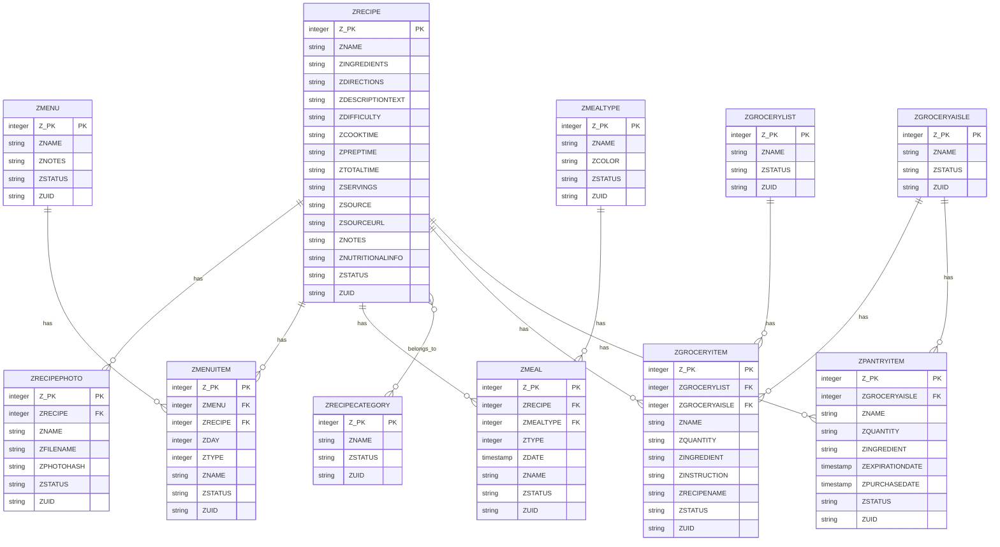

# Paprika AI Assistant

[](https://github.com/kleinjm/paprika_ai/actions/workflows/ci.yml)

An AI-powered assistant for your Paprika Recipe Manager database. This application provides intelligent features like meal planning, recipe analysis, and ingredient substitutions using AI.

## Features

### AI Meal Planning
- Multi-select recipe categories from your Paprika library to constrain the candidate pool
- Configurable number of recipes (default 4) and a customizable prompt, with a detailed default covering leftovers, stove/oven contention, and cuisine pairing
- Live prompt preview that updates as you tweak categories, count, or prompt text (Stimulus `meal-plan` controller backed by `home#meal_plan_prompt_preview`)
- Sends the candidate recipe pool as JSON to Gemini and returns a day-grouped meal plan with reasoning

### AI Recipe Analysis
- Lists every recipe from the read-only Paprika SQLite database along with its categories
- One-click "Analyze" button per recipe sends name, ingredients, and directions to Gemini
- Results render in place via Turbo Streams

### AI Ingredient Substitutions
- Free-text ingredient input returns Gemini-generated substitution suggestions, rendered via Turbo Stream

### Paprika Data Layer (read-only)
- ActiveRecord models against the Paprika SQLite database: Recipe, Category / RecipeCategory, Menu / MenuItem, Meal / MealType, GroceryList / GroceryItem / GroceryAisle, PantryItem, Bookmark, RecipePhoto, SyncStatus
- `Recipe#to_ai_json` shape used to feed AI prompts

### Infrastructure
- `GeminiService` (primary, `gemini-2.0-flash`) with a stubbed-out `ChatGptService` alternative
- Dual database setup: PostgreSQL for app data, SQLite for the Paprika source
- Bootstrap 5.3 + SASS pipeline, Hotwire (Turbo Streams + Stimulus), importmap, PWA scaffolding

## Database Schema


```mermaid
erDiagram
    ZRECIPE ||--o{ ZRECIPEPHOTO : has
    ZRECIPE ||--o{ ZMENUITEM : has
    ZRECIPE ||--o{ ZMEAL : has
    ZRECIPE }o--o{ ZRECIPECATEGORY : belongs_to
    ZRECIPE ||--o{ ZGROCERYITEM : has
    ZRECIPE ||--o{ ZPANTRYITEM : has
    ZMENU ||--o{ ZMENUITEM : has
    ZMEALTYPE ||--o{ ZMEAL : has
    ZGROCERYLIST ||--o{ ZGROCERYITEM : has
    ZGROCERYAISLE ||--o{ ZGROCERYITEM : has
    ZGROCERYAISLE ||--o{ ZPANTRYITEM : has

    ZRECIPE {
        integer Z_PK PK
        string ZNAME
        string ZINGREDIENTS
        string ZDIRECTIONS
        string ZDESCRIPTIONTEXT
        string ZDIFFICULTY
        string ZCOOKTIME
        string ZPREPTIME
        string ZTOTALTIME
        string ZSERVINGS
        string ZSOURCE
        string ZSOURCEURL
        string ZNOTES
        string ZNUTRITIONALINFO
        string ZSTATUS
        string ZUID
    }

    ZRECIPECATEGORY {
        integer Z_PK PK
        string ZNAME
        string ZSTATUS
        string ZUID
    }

    ZMENU {
        integer Z_PK PK
        string ZNAME
        string ZNOTES
        string ZSTATUS
        string ZUID
    }

    ZMENUITEM {
        integer Z_PK PK
        integer ZMENU FK
        integer ZRECIPE FK
        integer ZDAY
        integer ZTYPE
        string ZNAME
        string ZSTATUS
        string ZUID
    }

    ZMEAL {
        integer Z_PK PK
        integer ZRECIPE FK
        integer ZMEALTYPE FK
        integer ZTYPE
        timestamp ZDATE
        string ZNAME
        string ZSTATUS
        string ZUID
    }

    ZMEALTYPE {
        integer Z_PK PK
        string ZNAME
        string ZCOLOR
        string ZSTATUS
        string ZUID
    }

    ZGROCERYLIST {
        integer Z_PK PK
        string ZNAME
        string ZSTATUS
        string ZUID
    }

    ZGROCERYITEM {
        integer Z_PK PK
        integer ZGROCERYLIST FK
        integer ZGROCERYAISLE FK
        string ZNAME
        string ZQUANTITY
        string ZINGREDIENT
        string ZINSTRUCTION
        string ZRECIPENAME
        string ZSTATUS
        string ZUID
    }

    ZGROCERYAISLE {
        integer Z_PK PK
        string ZNAME
        string ZSTATUS
        string ZUID
    }

    ZPANTRYITEM {
        integer Z_PK PK
        integer ZGROCERYAISLE FK
        string ZNAME
        string ZQUANTITY
        string ZINGREDIENT
        timestamp ZEXPIRATIONDATE
        timestamp ZPURCHASEDATE
        string ZSTATUS
        string ZUID
    }

    ZRECIPEPHOTO {
        integer Z_PK PK
        integer ZRECIPE FK
        string ZNAME
        string ZFILENAME
        string ZPHOTOHASH
        string ZSTATUS
        string ZUID
    }
```

## Setup

1. Clone the repository:
```bash
git clone https://github.com/yourusername/paprika_ai.git
cd paprika_ai
```

2. Install dependencies:
```bash
bundle install
```

3. Set up environment variables:
```bash
cp .env.example .env
```
Edit `.env` and add your API keys:
- `OPENAI_API_KEY` (optional, for ChatGPT features)
- `GEMINI_API_KEY` (required for Gemini features)

4. Configure database:
The app reads from your local Paprika Recipe Manager SQLite database. Update the path in `config/database.yml` if needed:
```yaml
readonly_paprika:
  adapter: sqlite3
  database: "/path/to/your/Paprika.sqlite"
  readonly: true
```

5. Start the server:
```bash
rails server
```

6. Visit `http://localhost:3000` in your browser

## Development

- Ruby version: 3.2.0
- Rails version: 8.0
- Database: PostgreSQL (development) + SQLite (Paprika read-only)

## License

MIT
